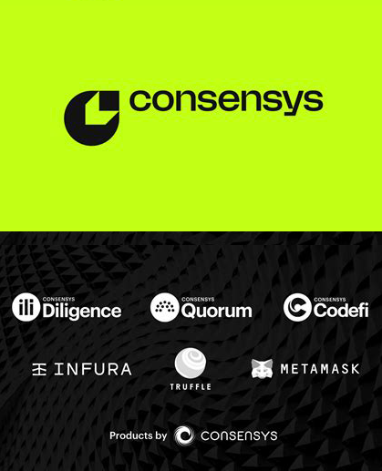

<div align="center">

<br>

<h1><strong> Consensys PoC </strong></h1>

<br></br>



</div>

## Description

Simple example on how to implement the following Consensys's products:

- [Infura: Node provider](https://infura.io/)
- [Linea: Deployment blockchain](https://www.linea.build/)
- [MetaMask: Web3 wallet](https://metamask.io/)

## Live test

This Poc project can be tested live on Linea testnet here: [https://consensys-poc.vercel.app/](https://consensys-poc.vercel.app/)

The contract has been deployed on the Linea Goerli testnet at the following address:
[https://goerli.lineascan.build/address/0x99482d34dD610067b66b0A32Fa3Cf1a512D77b2b](https://goerli.lineascan.build/address/0x99482d34dD610067b66b0A32Fa3Cf1a512D77b2b)

## Installation

Start by cloning the repository:

```bash
git clone https://github.com/Pedrojok01/ConsensysPoC.git .
```

### Smart contracts

Then, to deploy the smart contracts, you will need to create a `.env` file in the `foundry` folder with the following content:

```bash
## NODE ACCESS:
INFURA_API_KEY="YOUR_INFURA_API_KEY"

## API KEY for explorers to verify contracts:
LINEASCAN_API_KEY="YOUR_LINEASCAN_API_KEY"

## Private key:
PRIVATE_KEY="YOUR_PRIVATE_KEY"
```

Once your env variables are set, you can deploy the smart contracts by running the following commands:

```bash
cd foundry
```

Then, install the dependencies:

```bash
forge install foundry-rs/forge-std OpenZeppelin/openzeppelin-contracts
```

Finally, deploy the smart contracts:

```bash
forge script script/ConsensysPoC.s.sol:ConsensysPoCScript --rpc-url linea-testnet --broadcast --verify --etherscan-api-key <ETHERSCAN_API_KEY> --watch
```

### Frontend

Move back to the root folder, then to the `frontend` folder:

```bash
cd ../frontend
```

To run the frontend, you will need to create a `.env` file in the `frontend` folder with the following content:

```bash
## NODE ACCESS:
INFURA_API_KEY="YOUR_INFURA_API_KEY"
```

Once your env variables are set, run the following command to install the dependencies:

```bash
yarn install
```

Finally, run the frontend in a local server with:

```bash
yarn dev
```

Open [http://localhost:3000](http://localhost:3000) with your browser to see the result.

<p align="right">(<a href="#top">back to top</a>)</p>
